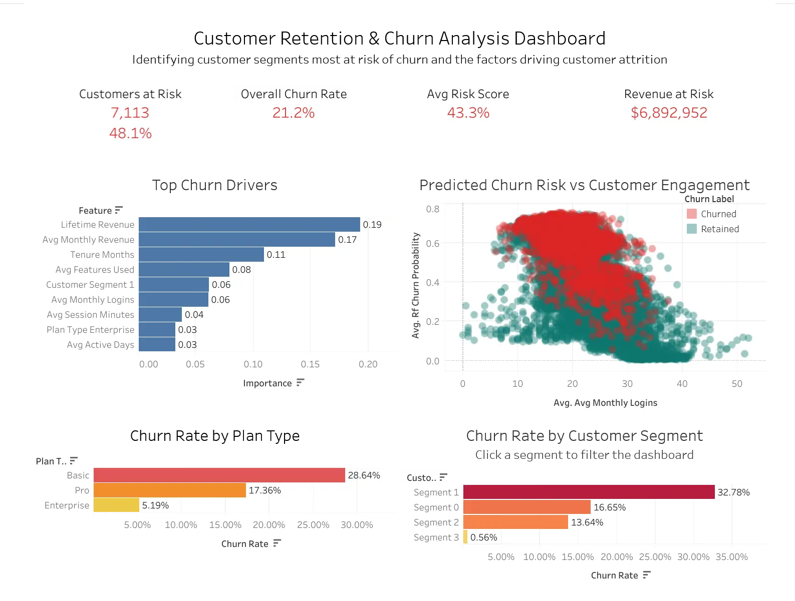

# Customer Retention & Growth Analysis

Python | SQL | Hypothesis Testing | A/B Testing | K-Means Clustering | Classification Modeling | Tableau


**Project Overview**  

This project analyzes customer churn for a SaaS company using customer profile, subscription, product usage, support, and churn data. SQL was used to build a customer-level dataset from multiple relational tables, followed by exploratory analysis, hypothesis testing, customer segmentation, and predictive modeling. The goal was to identify churn patterns and evaluate machine learning models capable of identifying customers at risk of leaving.

**Problem Statement**  

When customer retention weakens, a company can lack visibility into which customers are most at risk of churning and the factors driving those decisions. An onboarding experiment had already been implemented in an effort to improve retention, but the results showed no statistically significant reduction in churn. Without a clear understanding of customer behavior and churn risk, retention efforts can be difficult to target effectively. This analysis was conducted to identify the characteristics most closely associated with churn and provide data driven recommendations to support future retention strategies.

**Key Takeaways**

* Behavioral metrics consistently outperformed demographic variables throughout the analysis, with lower engagement, shorter tenure, and lower revenue all strongly associated with customer churn. This suggests that how customers use the product is far more informative than who they are.
* Higher engagement was consistently associated with longer customer tenure, greater lifetime revenue, and lower churn, indicating that these metrics describe different aspects of overall customer health. Customers who actively used the platform tended to remain customers longer and generate greater long term value.
* K-Means clustering identified one customer segment characterized by lower engagement, lower customer value, and substantially higher churn than the remaining groups. This demonstrates that churn risk is concentrated within a specific behavioral profile rather than being evenly distributed across the customer base.
* Although churn rates differed slightly between the treatment and control groups, statistical testing found no significant evidence that the onboarding intervention improved customer retention. These results suggest the current onboarding strategy should be reevaluated before broader implementation.
* All three classification models produced similar performance, with Random Forest achieving the strongest overall results. The modest differences between models suggest that improving feature quality would likely have a greater impact than changing algorithms.
* Predicting which customers are likely to churn is valuable, but estimating the associated revenue exposure provides a clearer picture of business impact. Combining churn predictions with customer revenue helps prioritize retention efforts where the potential financial return is greatest.

**Interactive Tableau Dashboard:**



[View the Interactive Customer Retention & Churn Risk Dashboard on Tableau Public](https://public.tableau.com/app/profile/alfred.rico/viz/CustomerRetentionChurnAnalysis_17821991224520/CustomerRetentionChurnRiskDashboard)

---

## Reproducibility

This project uses **UV** for fast, deterministic environment management.

### 🔧 Prerequisites

Install UV (official guide):
https://docs.astral.sh/uv/getting-started/

### ▶️ Run Locally (Step-by-Step)

```bash
# 1. Clone the repository
git clone https://github.com/AlfredRico/Customer-Retention-Growth-Analysis.git
cd Customer-Retention-Growth-Analysis

# 2. Sync environment (installs Python + dependencies)
uv sync

# 3. Launch Jupyter Lab
uv run jupyter lab
```

### 📂 Open the Project

Once Jupyter Lab opens in your browser:

1. Navigate to the project root directory  
2. Open the notebook:

   ```
   customer_retention_growth_analysis.ipynb
   ```

3. Run all cells from top to bottom  

### 🧠 Notes

- The environment is fully defined by:
  - `pyproject.toml`
  - `uv.lock`
- No manual package installation is required  
- Results are fully reproducible across systems  


## Repository Structure

```text
customer_retention_growth/
│
├── data/
│   ├── customer_retention_growth.db
│   ├── customers.csv
│   ├── subscriptions.csv
│   ├── usage_metrics.csv
│   ├── support_tickets.csv
│   ├── churn.csv
│   ├── experiments.csv
│   ├── tableau_customer_retention_export.csv
│   └── feature_importance_tableau.csv
│
├── documentation/
│   └── data_dictionary.csv
│
├── images/
│   ├── correlation_heatmap.png
│   ├── feature_importance.png
│   └── tableau_dashboard.png
│	
├── notebooks/
│   └── Customer_Retention_Growth_Analysis.ipynb
│
├── sql/
│   └── customer_kpis.sql
│
├── README.md
├── Customer_Retention_Churn_Dashboard.twb
├── pyproject.toml
├── uv.lock
└── .gitignore
```


## Technologies Used

### Programming & Data Processing
- Python
- SQLite
- Pandas
- NumPy

### Statistical Analysis
- SciPy
- Statsmodels

### Machine Learning
- Scikit-learn

### Data Visualization
- Matplotlib
- Tableau Public

### Development Environment
- Jupyter Notebook
- uv


## Project Workflow

1. SQL data extraction
2. Data cleaning and preprocessing
3. Feature engineering
4. Exploratory data analysis
5. Statistical hypothesis testing
6. A/B testing
7. Customer segmentation using K-Means
8. Predictive modeling
9. Model evaluation
10. Interactive Tableau dashboard
11. Business recommendations

---

## Analysis Summary

### Dataset

Customer information was originally distributed across multiple relational tables containing:

* Customer demographics
* Subscription history
* Product usage
* Support interactions
* Churn outcomes
* Onboarding experiment participation

SQL joins and aggregate queries were used to consolidate these tables into a single customer-level analytical dataset containing approximately **14,800 customers**.


### Data Preparation

The analytical dataset was prepared through:

* Missing value treatment
* Datetime conversion
* Customer tenure calculation
* Feature engineering
* One-hot encoding
* Feature scaling
* Correlation analysis
* Multicollinearity assessment

Business-specific features were also engineered, including lifetime revenue, average monthly revenue, recent login activity, customer tenure, support metrics, and customer segments.


### Exploratory Data Analysis

EDA focused on identifying differences between retained and churned customers by examining:

* Revenue
* Customer tenure
* Product engagement
* Login frequency
* Feature usage
* Subscription plans
* Customer segments
* Support activity

These analyses established the relationships later confirmed through statistical testing and predictive modeling.


### Statistical Analysis

Hypothesis testing was used to determine whether observed relationships represented statistically significant differences rather than random variation.

An A/B test evaluating a proposed onboarding intervention found **no statistically significant reduction in customer churn**, suggesting the current onboarding strategy was not effective at improving retention.


### Customer Segmentation

K-Means clustering identified four distinct customer segments based on customer value and engagement.

One segment consistently demonstrated lower engagement, lower revenue, and substantially higher churn, making it the highest priority group for future retention efforts.


### Predictive Modeling

Three classification models were trained and evaluated:

* Logistic Regression
* Decision Tree
* Random Forest

Models were compared using:

* Accuracy
* Precision
* Recall
* F1 Score
* ROC AUC

The Random Forest model achieved the strongest overall performance, producing the highest accuracy and ROC-AUC score while maintaining competitive churn detection performance.

Feature importance analysis identified revenue, tenure, engagement, and customer segment membership as the strongest predictors of customer churn.


## Overall Summary

Taken together, the analyses suggest that customer churn is primarily a behavioral problem rather than a demographic one. Customers who fail to integrate the product into their regular workflow generate less revenue, remain customers for shorter periods, and are substantially more likely to leave. Customer segmentation further demonstrates that these behavioral patterns are concentrated within a specific high-risk group rather than being evenly distributed across the customer base.

The predictive modeling results reinforce these findings by consistently identifying revenue, tenure, engagement, and customer segment membership as the strongest predictors of churn. Although the Random Forest model achieved the best overall performance, the modest differences between models indicate that improving feature quality would likely produce greater gains than selecting a different classification algorithm.

Finally, the onboarding experiment suggests that simply introducing customers to the product is not sufficient to improve long-term retention. Future retention strategies should focus less on one-time onboarding activities and more on increasing sustained product engagement, particularly among newer and lower-value customers who have not yet established consistent usage patterns.

---

## Business Recommendations

* Segment 1 customers should be the primary focus of retention efforts, as they experienced the highest churn rates and the lowest engagement levels.
* Customers averaging fewer than 20 monthly logins exhibit substantially higher predicted churn risk. Retention efforts should prioritize low-login customers through onboarding campaigns, feature adoption outreach, and intervention resources.
* The onboarding experiment did not significantly improve retention, suggesting that a different approach may be needed.
* The model identified 7,113 customers in the High Risk segment representing approximately $6.9M in revenue exposure. Prioritizing retention efforts on this segment offers the highest potential return on intervention resources.
* Customer behavior was a much stronger indicator of churn than demographic characteristics, so future retention strategies should focus on engagement and product adoption.

---

## Ecosystem

Portfolio webpage → [Project hub and navigation](https://alfredrico.github.io/)

GitHub → [Project repositories featuring UV management for reproducibility](https://github.com/AlfredRico)